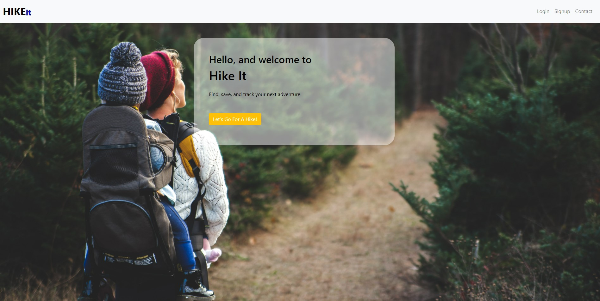
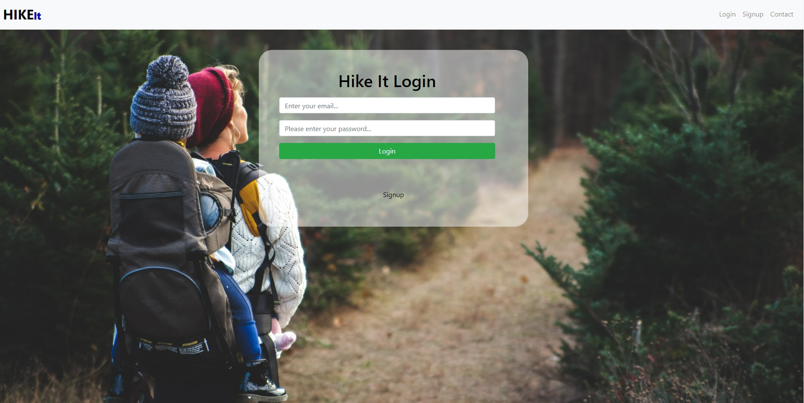

# Hike_It

### Table of Contents

- [Description](#description)
- [Creators](#creators)
- [Installation](#installation)
- [Technologies_Used](#technologies_used)
- [Media](#media)
- [Contact_Info](#contact_info)

## Description:

HikeIt is a hiking application that allows you to search for hiking trails in your area. With HikeIt, you can add trails that you have either hiked or would like to hike to your user profile. HikeIt also allows you to track your workout data and save it to your account. HikeIt! A great and interactive way to stay active!

### Creators

- Maria Vallejo
- Andrew Martinez
- Matthew Wiessing
- Alfonso Robles

#### Installation

- `npm install`
- `npm i apollo-graphql`
- `npm run develop`
- `npm start`

#### Technologies_Used

- MongoDB
- Apollo Server
- Express
- GraphQL

#### Media

- [HikeIt](https://hikeit2022.herokuapp.com/)

- 
- 
- 
- 
- 

#### Contact_Info

- MARIA VALLEJO:
- Github (https://github.com/Mvalljo)
- LinkedIn (https://www.linkedin.com/in/maria-vallejo-8237a41a6/)

- MATTHEW WIESSING:
- Github (https://github.com/Kiasiri)
- LinkedIn (http://www.linkedin.com/in/matthew-wiessing-06b754214)

- ANDREW MARTINEZ:
- Github (https://github.com/andrew18929)
- LinkedIn (https://www.linkedin.com/in/andrew-martinez-03144b192)

- ALFONSO ROBLES:
- Github (https://github.com/fons3517)
- LinkedIn (https://www.linkedin.com/in/alfonso-robles-3517-agr/)
